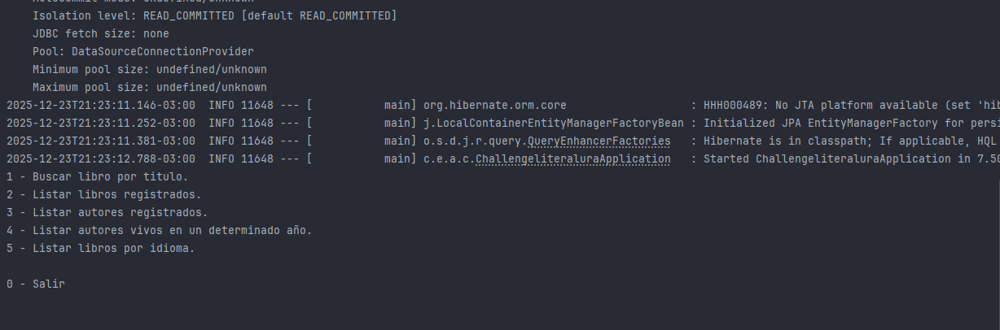
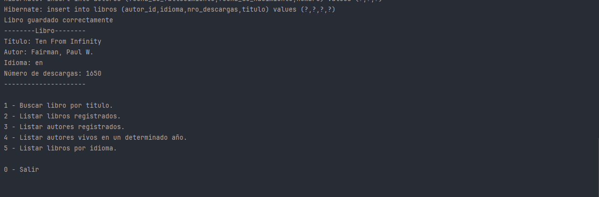
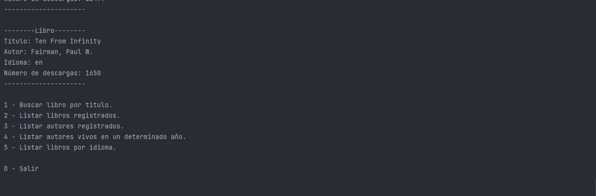
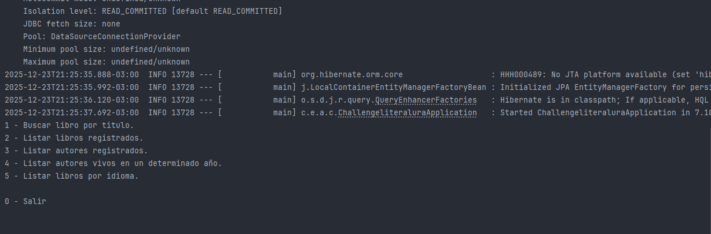
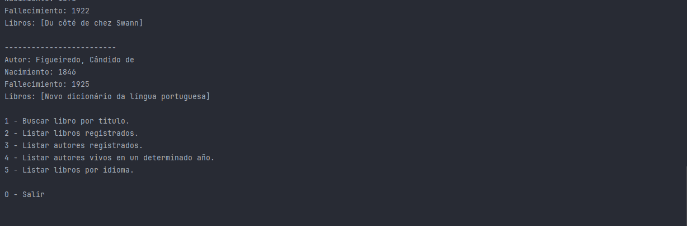

# 📚 Challenge Literalura del programa One Oracle/Alura Latam

<p align="left">
   
   
   
</p>

## 📝 Descripción

Literalura es una aplicación de consola desarrollada en Java utilizando el framework Spring Boot. Su objetivo principal es permitir a los usuarios buscar libros, consultar información sobre autores y filtrar resultados mediante una interacción fluida con la API de [Gutendex](https://gutendex.com/). Los datos consultados se persisten en una base de datos PostgreSQL para consultas posteriores sin necesidad de volver a la API.

## 🚀 Funcionalidades

A continuación se demuestran las principales funcionalidades de la aplicación:

### 1. Búsqueda de libros por título
Conecta con la API, busca el libro, muestra sus datos y lo guarda automáticamente en la base de datos local.


### 2. Listar libros registrados
Muestra todos los libros que han sido buscados y guardados previamente en la base de datos.


### 3. Listar autores registrados
Exhibe la lista de autores asociados a los libros guardados, incluyendo sus años de nacimiento y fallecimiento.


### 4. Listar autores vivos en un año determinado
Permite ingresar un año específico y filtra a los autores que estaban vivos en esa fecha.


### 5. Filtrar libros por idioma
Opción para listar los libros almacenados según su idioma (Español, Inglés, Francés, Portugués).


## 🛠️ Tecnologías Utilizadas

* **Java 17**
* **Spring Boot 3** (Spring Data JPA)
* **PostgreSQL** (Base de datos)
* **Maven** (Gestor de dependencias)
* **Gutendex API** (Fuente de datos)
* **Jackson** (Mapeo de JSON a objetos Java)

## ⚙️ Configuración y Ejecución

### Prerrequisitos
* Tener instalado Java 17 o superior.
* Tener instalado PostgreSQL.

### Variables de Entorno
El proyecto utiliza variables de entorno para la conexión a la base de datos. Asegúrate de configurarlas en tu sistema o en tu IDE antes de ejecutar:

* `DB_HOST`: Host de la base de datos (ej: `localhost:5432`)
* `DB_NAME`: Nombre de base de datos de PostgreSQL.
* `DB_USER`: Tu usuario de PostgreSQL.
* `DB_PASSWORD`: Tu contraseña de PostgreSQL.

### Pasos para correr el proyecto
1.  Clonar el repositorio.
2.  Crear la base de datos en PostgreSQL con el nombre `literalura` o el nombre de tu preferencia.
3.  Ejecutar el proyecto desde tu IDE o mediante consola:
    ```bash
    ./mvnw spring-boot:run
    ```

## 👤 Autor
Desarrollado por Lucas Lopez como parte del desafío del Programa One Oracle-Alura Latam.